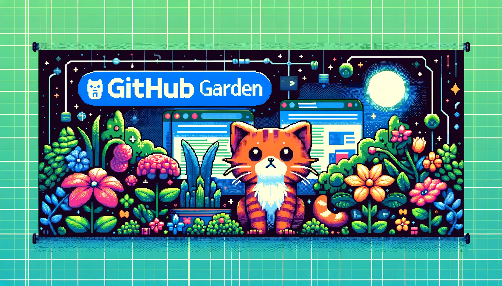

# GitHub Garden



GitHub Garden is a desktop application that allows you to paint your GitHub commit history with custom patterns. You can choose from a variety of patterns or commit dynamically based on your existing commits. The app can be run from your local PC or from a server.

## Features

- **Paint Your Commits**: Use the graphical interface to paint commit patterns.
- **Flexible Scheduling**: Commit once a day, multiple times a day, randomly, or dynamically based on existing commits.
- **Local and Server Execution**: Run the app locally or deploy it to a server.
- **GitHub Integration**: Seamless integration with GitHub for committing your patterns.

## Requirements

- Python 3.x
- PyQt5
- PyGithub

## Installation

1. **Clone the repository:**

    ```bash
    git clone https://github.com/yourusername/github-garden.git
    cd github-garden
    ```

2. **Create a virtual environment and activate it:**

    ```bash
    python -m venv venv
    source venv/bin/activate  # On Windows use `venv\Scripts\activate`
    ```

3. **Install the required dependencies:**

    ```bash
    pip install -r requirements.txt
    ```

## Usage

1. **Configure your GitHub settings:**

    Edit the `app/config.py` file with your GitHub token and repository name:

    ```python
    CONFIG = {
        'github_token': 'your_github_token_here',
        'repo_name': 'your_repo_name_here'
    }
    ```

2. **Run the application:**

    ```bash
    python app/main.py
    ```

3. **Using the GUI:**

    - **Paint your commit pattern**: Click on the grid to toggle commits for each day.
    - **Schedule commits**: Use the available options to schedule commits based on your painted pattern.

## Contributing

Contributions are welcome! Please fork the repository and submit a pull request.

## License

This project is licensed under the MIT License.

## Contact

For any questions or suggestions, please open an issue or contact the repository owner.


